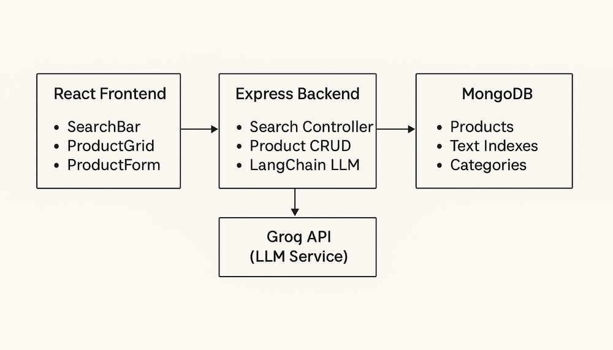

# LangChain Smart Product Search 🛍️🔍

**AI-Powered E-commerce Search** - Transform shopping with conversational intelligence. Ask questions like *"Show me comfortable running shoes under $150"* and get instant, relevant results powered by advanced language models.

## 🌟 What Makes Smart Product Search Revolutionary?

Traditional e-commerce search forces users to navigate complex filters and dropdowns. **Smart Product Search** changes everything by understanding natural language queries and delivering personalized results instantly.

### The Problem with Traditional Search
- ❌ *"I need to click through categories, brands, price ranges..."*
- ❌ *"Multiple filters to apply, still get irrelevant results"*
- ❌ *"Can't describe what I want in plain English"*

### The Smart Search Solution
- ✅ *"Show me Apple products under $1000"* → Instantly finds iPhones, MacBooks, etc.
- ✅ *"Comfortable running shoes for under $150"* → Searches across Nike, Adidas, descriptions
- ✅ *"Samsung electronics with good cameras"* → Matches Galaxy phones, cameras, TVs

**Powered by LangChain + Groq's llama-3.1-8b-instant model** for lightning-fast, context-aware search that understands intent, preferences, and shopping context.

## 🚀 Live Demo

*Coming soon - Deployed version with full functionality*

## 📋 Overview

This full-stack application consists of two main components:

- **Frontend** 🎨: Modern React TypeScript interface with responsive design
- **Backend** ⚙️: Node.js API with MongoDB, LangChain integration, and smart search algorithms

### Key Features ✨
- **Natural Language Search**: Ask questions in plain English
- **AI-Powered Filtering**: LLM extracts intent and applies structured filters
- **Comprehensive Fallback**: Text search across all product fields when AI parsing fails
- **Real-time Results**: Instant search with loading states and error handling
- **Full CRUD Operations**: Complete product management system
- **Responsive Design**: Works seamlessly on all devices

## 🏗️ Architecture Diagram



**Architecture Overview:**
- **React Frontend**: User interface with search components and responsive design
- **Express Backend**: API layer handling CRUD operations and LangChain integration
- **MongoDB**: Document database with text indexing for efficient search
- **Groq API**: LLM service for natural language processing and intent extraction

**Data Flow:**
1. User enters natural language query in React frontend
2. Frontend sends query to Express backend API
3. Backend uses LangChain to process query with Groq LLM
4. LLM extracts structured filters from natural language
5. Backend queries MongoDB with filters or falls back to comprehensive search
6. Results returned to frontend for display

## 💡 How Smart Search Actually Works

### Step 1: Natural Language Understanding 🤖
When you type *"iPhone under $1000"*:
- **LangChain** processes your query using **Groq's llama-3.1-8b-instant** model
- The AI understands context: you're looking for Apple products (iPhones) with a budget constraint
- **Intelligent Parsing**: Extracts structured filters like `{"brand": "Apple", "maxPrice": 1000}`

### Step 2: Dual Search Strategy 🎯
- **Primary Search**: Applies AI-extracted filters to MongoDB for precise results
- **Smart Fallback**: If AI parsing is unclear, performs comprehensive text search across:
  - Product names
  - Brand names  
  - Detailed descriptions
  - Category classifications

## 📦 Quick Start

### Prerequisites
- Node.js v18+
- MongoDB (local or Atlas)
- Groq API key

### Installation

```bash
# Clone the repository
git clone https://github.com/vanshitaa-shah/Langchain-smart-search.git
cd langchain-crud

# Backend Setup
cd langchain-crud-backend
npm install
cp .env.example .env
# Edit .env with your MongoDB URI and Groq API key
npm run dev

# Frontend Setup (new terminal)
cd ../langchain-crud-frontend
npm install
npm run dev
```

### Environment Configuration

**Backend (.env):**
```env
MONGODB_URI=mongodb://localhost:27017/langchain-crud
PORT=3001
GROQ_API_KEY=your_groq_api_key_here
NODE_ENV=development
```

**Frontend (.env):**
```env
VITE_API_URL=http://localhost:3001/api
```

## 📡 API Endpoints Guide

### Product Management 🛍️
| Method | Endpoint | Description | Example |
|--------|----------|-------------|---------|
| `GET` | `/api/products` | Get all products | Returns product catalog |
| `POST` | `/api/products` | Add new product | Creates product with validation |
| `PUT` | `/api/products/:id` | Update product | Modifies existing product |
| `DELETE` | `/api/products/:id` | Remove product | Deletes product by ID |

### Smart Search 🔍
| Method | Endpoint | Description | Magic Feature |
|--------|----------|-------------|--------------|
| `POST` | `/api/search` | Natural language search | AI-powered query understanding |

**Search Request Example:**
```json
{
  "query": "Nike shoes under $200"
}
```

**Smart Response:**
```json
{
  "query": "Nike shoes under $200",
  "filters": {
    "brand": "Nike",
    "category": "Shoes", 
    "maxPrice": 200
  },
  "results": [
    {
      "id": "...",
      "name": "Nike Air Zoom Pegasus",
      "brand": "Nike",
      "price": 129.99,
      "category": "Shoes"
    }
  ],
  "count": 1
}
```

## 🎯 Smart Search Examples

| Natural Language Query | AI Interpretation | What It Finds |
|------------------------|------------------|---------------|
| *"iPhone under 1000"* | `brand: Apple, maxPrice: 1000` | iPhone 14, iPhone 15, iPhone SE |
| *"Nike running shoes"* | `brand: Nike, category: Shoes` + text search | Air Zoom, Pegasus, React running shoes |
| *"Samsung electronics"* | `brand: Samsung, category: Electronics` | Galaxy phones, TVs, laptops |
| *"clothing under 50"* | `category: Clothing, maxPrice: 50` | T-shirts, jeans, accessories |
| *"gaming laptop camera"* | Text search across all fields | Laptops with good cameras for streaming |
| *"Apple wireless earbuds"* | `brand: Apple` + text search | AirPods, AirPods Pro, AirPods Max |
| *"comfortable sneakers"* | Text search in descriptions | Shoes described as "comfortable" |

**💡 Pro Tip**: The more specific your query, the smarter the results. Mix brands, categories, and features for best results!

## 📁 Project Structure

```
langchain-crud/
├── langchain-crud-frontend/
│   ├── src/
│   │   ├── components/     # React components
│   │   ├── hooks/         # Custom React hooks
│   │   ├── services/      # API services
│   │   ├── types/         # TypeScript types
│   │   └── assets/        # Static assets
│   ├── public/            # Public files
│   └── package.json
└── langchain-crud-backend/
    ├── config/            # Database & LLM config
    ├── controllers/       # Route handlers
    ├── models/           # MongoDB schemas
    ├── routes/           # API routes
    ├── schemas/          # Validation schemas
    ├── templates/        # LLM prompts
    ├── utils/            # Helper functions
    └── package.json
```

## 🔧 Development

### Running in Development
```bash
# Backend (Terminal 1)
cd langchain-crud-backend && npm run dev

# Frontend (Terminal 2)
cd langchain-crud-frontend && npm run dev
```

### Building for Production
```bash
# Backend
cd langchain-crud-backend && npm run build

# Frontend
cd langchain-crud-frontend && npm run build
```

## 📚 Additional Resources

### Backend Documentation
For detailed backend setup, API documentation, and advanced configuration, see:
📖 **[Backend README](./langchain-crud-backend/README.md)**

This includes:
- Detailed setup instructions
- Database schema information
- API endpoint specifications
- Troubleshooting guides
- Development workflows

**Transforming e-commerce search with the power of AI** 🚀